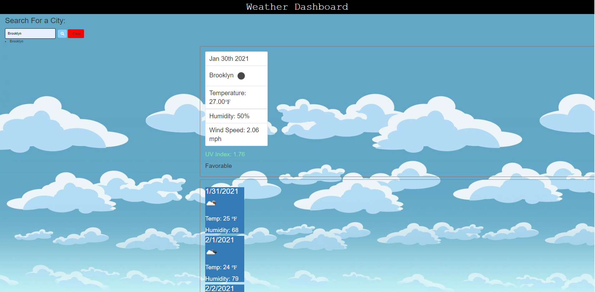

# Weather-Dashboard

# screenshot

# github live url
 https://swoo328.github.io/Weather-Dashboard/

# repository url
 https://github.com/swoo328/Weather-Dashboard

# summary
In this project I use the Weather API from https://openweathermap.org/
to get the current weather as well as the weather for next five days. Using 
this api I was able to get the data for the temperature, humidity, UV, and 
more. As you enter a location in the search input, the web page will provide 
the city name, the date, an icon that represent the weather currently, the temperature, the wind speed and the humidity. A color is indicate to show if 
the conditions are favorable, moderate or severe. Not only that, the web page also 
provides the 5 day forecast. The location that was input in the search bar will also be saved in the local storage and in the history. 
